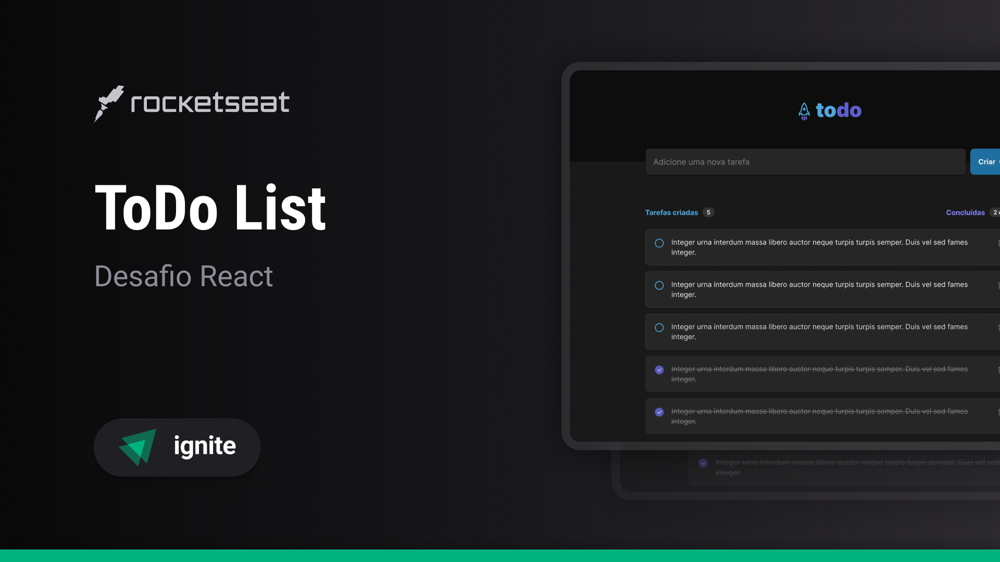

# ToDo

To-do list style task tracking application.


## Technologies Used

The project was developed using the following technologies

- [ReactJS](https://react.dev/)
- [TypeScript](https://www.typescriptlang.org)
- [Lucide React](https://lucide.dev/)
- [Sonner](https://sonner.emilkowal.ski/)
- [Eslint](https://eslint.org/)


## Running

After cloning the repository, access the project folder and execute the commands below:

```sh
npm install
npm run dev
```

Access http://localhost:5173 to view the application.
